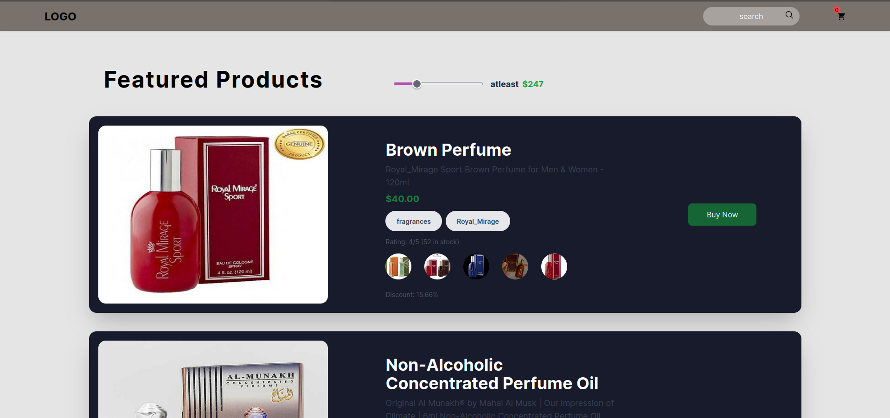
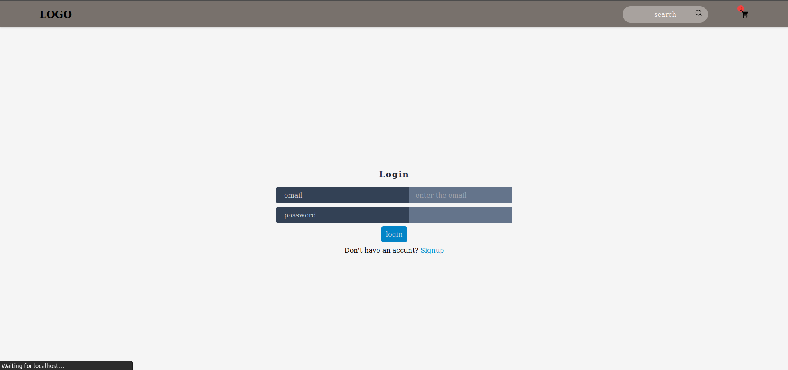
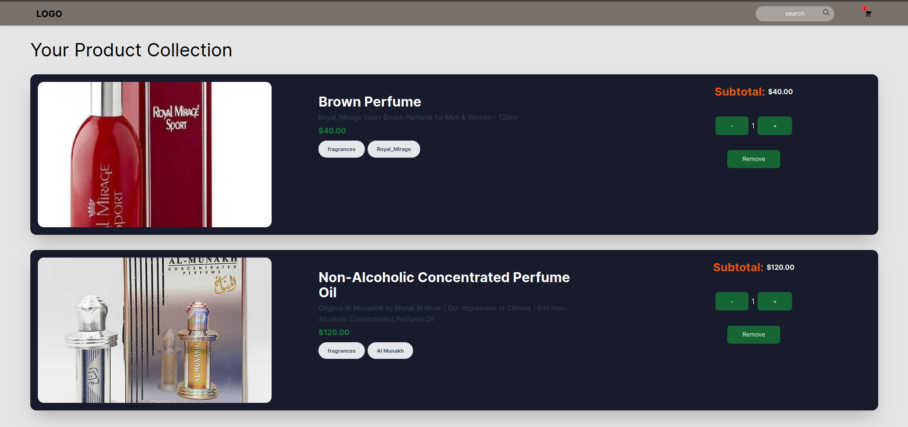

# Internshala Assignment - React JS Project

## Project Overview

This project is a React JS application that fulfills the requirements outlined in Option 2 of the Internshala assignment.
The application implements a login process, token storage for authorization, protected routes, product fetching, product search, price-based filtering, a shopping cart with count and total amount display, and an "Add to Cart" button on product cards.

The project is built using Next.js for the frontend, Redux Toolkit for state management, and Tailwind CSS for styling. The application has been successfully completed and deployed on Vercel.

## Screenshot



## Project Structure

The project is organized into several components and features:

- **Authentication:** Implements login functionality using [dummyjson.com/docs/auth](https://dummyjson.com/docs/auth) for authentication. The login token is stored for authorization purposes.

- **Protected Route:** The home page is a protected route, allowing only logged-in users to access it.

- **Product Fetching:** Fetches products from [dummyjson.com/docs/products](https://dummyjson.com/docs/products) and displays them on the home page.

- **Product Search:** Implements a search feature to filter products based on their names.

- **Price Filtering:** Adds a filter option on the home page to filter products based on their prices.

- **Shopping Cart:** Implements a shopping cart functionality with an "Add to Cart" button on product cards. Displays the cart count on the top and the total amount of the cart.

## Deployment

The application has been deployed on Vercel and is accessible at [Live Vercel Deployment](#). Please note that the actual link will be provided separately.

## Instructions for Running the Project Locally

1. Clone the repository to your local machine.
```bash
   git clone https://github.com/anchalraj31082004/Dummykart.git
```

2. Install dependencies
```bash
    cd Dummykart
    npm install
```

3. Run the Developement server
```bash
    npm run dev
```

4. Open your browser and navigate to [http://localhost:3000](http://localhost:3000) to view the application.

## Note

The deployed link on Vercel is not working as expected. After login, it takes more time to redirect to the home page, or it may take one or more tries to redirect. I'm currently searching for why it's not redirecting immediately after login, as it was working well in localhost. It would be great if you could set it up locally.

## Extra Screenshots




